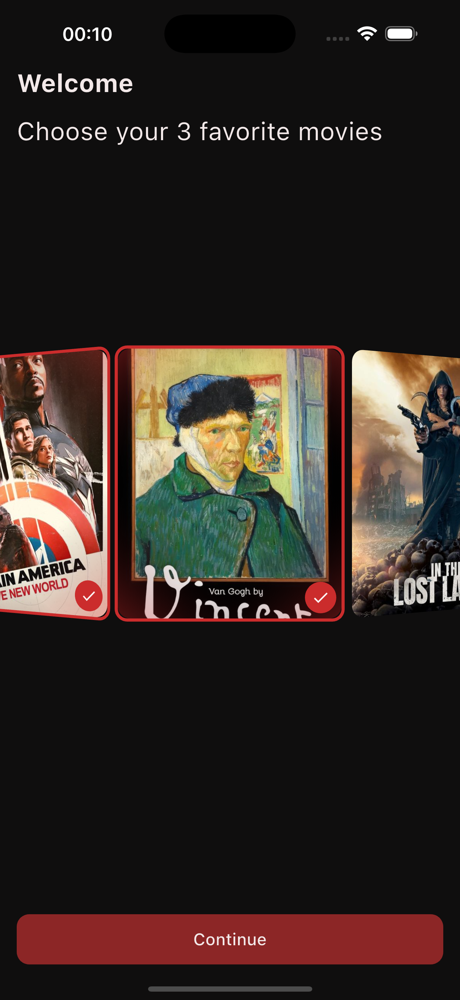
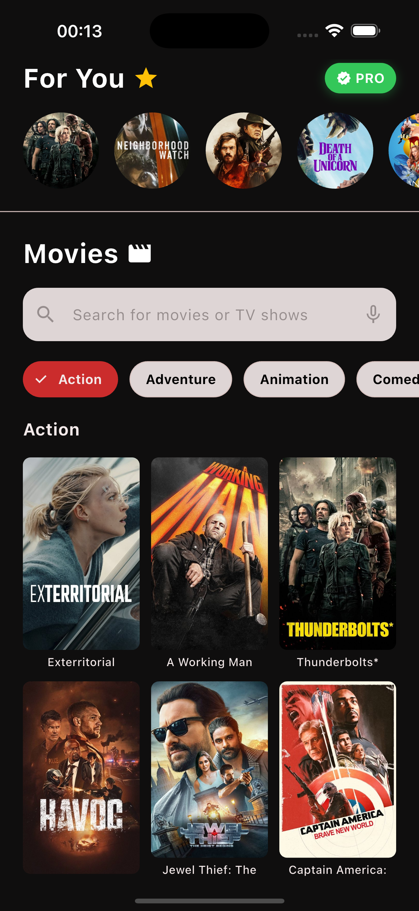
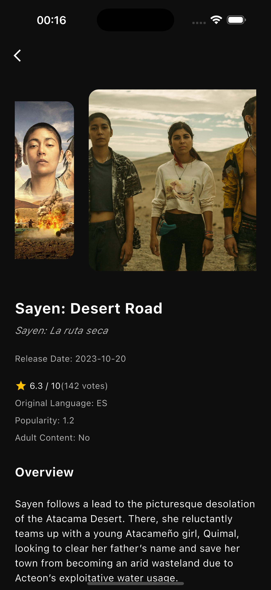
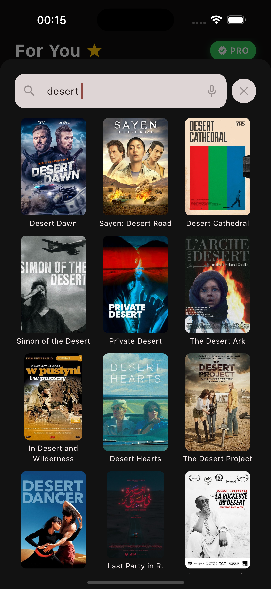
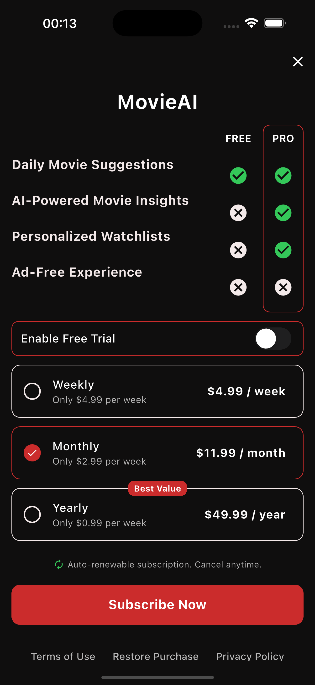

# BOBY Movie App 🎬 - EN

A modern and user-friendly movie discovery application. Explore popular films, access detailed information, and keep track of your favorite movies.

> **Note:** This project was developed as part of a study case provided during a job application process for the BOBYAI company. In addition to the required features, extra functionalities were also implemented.
## 📱 Ekran Görüntüleri

<div align="center">
  <table>
    <tr>
    <td align="center">
        
        <br />
        <em>Movie Selection</em>
      </td>
      <td align="center">
        
        <br />
        <em>Genre Selection</em>
      </td>
      <td align="center">
        
        <br />
        <em>Home</em>
      </td>
    </tr>
    <tr>
      <td align="center">
        
        <br />
        <em>Movie Details</em>
      </td>
      <td align="center">
        
        <br />
        <em>Search Screen</em>    
      </td>
      <td align="center">
        
        <br />
        <em>Paywall</em>
      </td>
    </tr>
  </table>
</div>

## 🚀 Features

- **Movie Discovery**: Discover popular and up-to-date movies using the TMDB API  
- **Category-Based Search**: Filter movies by genres  
- **Search Functionality**: Easily find the movies you're looking for  
- **Movie Details**: Access in-depth information, posters, and images of each movie  
- **Favorite Movies**: Add the movies you like to your favorites  
- **Personalization**: Choose your favorite genres and movies during onboarding  
- **Subscription Model**: Different subscription plans for pro features  
- **Infinite Scroll Movie List**: Smooth, scrollable movie listings  

## 🌟 Additional Features Developed for the Case

In addition to the core features required by the case, the following enhancements have been implemented in the project:

1. **SearchView**: A comprehensive search screen that allows searching the entire movie database  
2. **Onboarding Animations**: Stunning animations and transition effects in the genre selection screen  
3. **Pro Badge**: Visual indicators to highlight premium users  
4. **Detailed Movie Page (MovieView)**: A comprehensive screen containing full details of the selected movie  
   - Posters/images of the movie  
   - Cast information  
   - Director details  
   - IMDb rating and vote count  
   - Movie duration and release date  
   - Detailed movie description  
5. **Visual Enhancements**: Animations and transitions to enrich the user experience  
6. **Performance Optimizations**: Fast loading times and a smooth user experience  

## 🚧 Technical Limitations

Some challenges encountered during the development process:

- **Onboarding Movie List**: The case requirement was to display movie posters rotating along the inner surface of a circular path. In the current implementation, the movie list rotates on the outer side of a circular path. This limitation was due to the constraints of Flutter's ListWheelScrollView widget configuration.

## 🛠️ Technologies Used

- **Flutter** – UI development framework  
- **MobX** – Reactive state management  
- **GetIt** – Dependency injection  
- **Dio** – For HTTP requests  
- **TMDB API** – For movie data  
- **SharedPreferences** – Local data storage  
- **GoRouter** – Navigation and routing  
- **Cached Network Image** – Image caching for improved performance  

## 📂 Project Structure

```
lib/
├── app/
│ ├── common/ # General configurations
│ │ ├── config/ # API configurations
│ │ ├── constants/ # Constants such as colors and texts
│ │ ├── functions/ # Global helper functions
│ │ ├── get_it/ # Dependency injection setup
│ │ ├── router/ # Route configuration
│ │ └── widgets/ # Shared widgets
│ │
│ └── features/ # Feature-based folders
│ ├── data/ # Data layer
│ │ ├── datasources/ # Data sources (local, remote)
│ │ ├── models/ # Data models
│ │ └── repositories/ # Repository implementations
│ │
│ └── presentation/ # UI layer
│ ├── home/ # Home screen
│ ├── movie/ # Movie details
│ ├── onboarding/# Onboarding screens
│ ├── paywall/ # Paywall & subscriptions
│ └── search/ # Search screen
│
├── core/ # Core components
│ ├── assets/ # Asset manager
│ ├── dio_manager/ # HTTP request manager
│ ├── extensions/ # Extensions
│ ├── keys/ # Key values
│ ├── result/ # Result wrapper classes
│ └── widgets/ # Core widgets
│
└── main.dart # App entry point
```

## 🏗️ Architecture

The application is built following Clean Architecture principles:

- 📦 Repository Pattern: To abstract data sources
- ⚙️ MobX: For reactive state management
- 🧩 Dependency Injection: Managed via GetIt as a service locator
- 📁 Feature-First Structure: Organized by feature folders

## 📱 Screens

- 🧭 Onboarding: Allows users to select favorite genres and movies  
  - Animated genre selection screen  
  - Infinite scroll movie selection list  
- 🏠 Home: Recommended movies and categories  
  - Pro user badge  
  - Genre-based filtering  
- 🎬 Movie Details: Rich information about the selected movie  
  - Image gallery  
  - Cast list  
  - Technical details and reviews  
- 🔍 Search: Advanced movie search functionality  
  - Instant search results  
  - Filtering options  
- 💳 Subscription: Unlock pro features with payment plans  
  - Weekly, monthly, and annual plans  
  - Free trial option  
  - Feature comparison chart  

## 🚀 Installation

1. Install the Flutter SDK: [Flutter Installation Guide](https://flutter.dev/docs/get-started/install)
2. Clone the project:
   ```
   git clone https://github.com/develonursahin/bobyai_sc.git
   ```
3. Install dependencies:
   ```
   flutter pub get
   ```
4. Run the MobX code generator:
   ```
   flutter pub run build_runner build --delete-conflicting-outputs
   ```
5. Add your TMDB API key:  
Edit the file located at `lib/app/common/config/config.dart` and insert your API key.
6. Run the application:
   ```
   flutter run
   ```

## 📜 License

This project is licensed under the MIT License.

# BOBY Movie App 🎬 - TR

Modern ve kullanıcı dostu bir film keşif uygulaması. Popüler filmleri keşfedin, detaylı bilgilere erişin ve favori filmlerinizi takip edin.

> **Not:** Bu proje, BOBYAI şirketinin iş başvurusu sürecinde verilen bir study case olarak geliştirilmiştir. Case kapsamında istenen özelliklerin yanı sıra ek özellikler de projeye dahil edilmiştir.

## 📱 Ekran Görüntüleri

<div align="center">
  <table>
    <tr>
     <td align="center">
        
        <br />
        <em>Film Seçimi</em>
      </td>
      <td align="center">
        
        <br />
        <em>Tür Seçimi</em>
      </td>
      <td align="center">
        
        <br />
        <em>Ana Sayfa</em>
      </td>
    </tr>
    <tr>
      <td align="center">
        
        <br />
        <em>Film Detayları</em>
      </td>
      <td align="center">
        
        <br />
        <em>Arama Ekranı</em>
      </td>
      <td align="center">
        
        <br />
        <em>Abonelik Ekranı</em>
      </td>
    </tr>
  </table>
</div>

## 🚀 Özellikler

- **Film Keşfi**: TMDB API ile popüler ve güncel filmleri keşfedin
- **Kategori Bazlı Arama**: Film türlerine göre filtreleme yapın
- **Arama Özelliği**: İstediğiniz filmleri kolayca bulun
- **Film Detayları**: Filmlerin ayrıntılı bilgilerine, afişlerine ve görsellerine erişin
- **Favori Filmler**: Beğendiğiniz filmleri favorilerinize ekleyin
- **Kişiselleştirme**: Başlangıçta favori türlerinizi ve filmlerinizi seçin
- **Abonelik Modeli**: Pro özellikler için farklı abonelik paketleri
- **Sonsuz Dönen Film Listesi**: Kaydırmalı film listesi

## 🌟 Case Kapsamında Ekstra Geliştirmeler

Case kapsamında istenen temel özelliklerin yanı sıra, aşağıdaki ek geliştirmeler projeye dahil edilmiştir:

1. **SearchView**: Kapsamlı bir arama ekranı ile tüm film veritabanında arama yapabilme
2. **Onboarding Animasyonları**: Tür seçme ekranında çarpıcı animasyonlar ve geçiş efektleri
3. **Pro Etiketi**: Premium kullanıcıları belirten görsel etiketler
4. **Detaylı Film Sayfası (MovieView)**: Filmlerin tüm detaylarını içeren kapsamlı bir ekran
   - Film afişleri/görselleri
   - Oyuncu kadrosu  
   - Yönetmen bilgisi
   - İMDB puanı ve oylama bilgileri
   - Film süresi ve çıkış tarihi
   - Detaylı film açıklaması
5. **Görsel İyileştirmeler**: Kullanıcı deneyimini zenginleştiren animasyonlar ve geçişler
6. **Performance Optimizasyonları**: Hızlı yükleme ve pürüzsüz kullanıcı deneyimi

## 🚧 Teknik Kısıtlamalar

Geliştirme sürecinde karşılaşılan bazı zorluklar:

- **Onboarding Film Listesi**: Case gereksinimlerinde film afişlerinin bir çemberin iç yüzüne bakar şekilde dönmesi istenmiştir. Mevcut uygulamada, film listesi dıştan dönen bir çember şeklinde uygulanabilmiştir. Flutter'ın ListWheelScrollView widget'ının yapılandırması bu kısıtlamaya neden olmuştur.

## 🛠️ Teknolojiler

- **Flutter** - UI geliştirme framework'ü
- **MobX** - Durumu yönetmek için reaktif state management
- **GetIt** - Bağımlılık enjeksiyonu
- **Dio** - HTTP istekleri için 
- **TMDB API** - Film verileri için
- **SharedPreferences** - Yerel veri depolama
- **GoRouter** - Navigasyon ve rota yönetimi
- **Cached Network Image** - Görüntü önbelleğe alma

## 📂 Proje Yapısı

```
lib/
├── app/
│   ├── common/            # Genel yapılandırmalar
│   │   ├── config/        # API konfigürasyonları 
│   │   ├── constants/     # Renkler, metinler gibi sabitler
│   │   ├── functions/     # Genel fonksiyonlar
│   │   ├── get_it/        # Bağımlılık enjeksiyonu 
│   │   ├── router/        # Rota yapılandırması
│   │   └── widgets/       # Ortak widget'lar
│   │
│   └── features/          # Özellik bazlı klasörler
│       ├── data/          # Veri katmanı
│       │   ├── datasources/  # Veri kaynakları (yerel, uzak)
│       │   ├── models/       # Veri modelleri
│       │   └── repositories/ # Repository'ler
│       │
│       └── presentation/  # UI katmanı
│           ├── home/      # Ana sayfa
│           ├── movie/     # Film detayları
│           ├── onboarding/# Başlangıç ekranı
│           ├── paywall/   # Ödeme duvarı
│           └── search/    # Arama ekranı
│
├── core/                  # Temel bileşenler
│   ├── assets/           # Varlık yöneticisi
│   ├── dio_manager/      # HTTP istek yöneticisi
│   ├── extensions/       # Uzantılar
│   ├── keys/            # Anahtar değerler
│   ├── result/          # Sonuç sınıfları
│   └── widgets/         # Temel widget'lar
│
└── main.dart              # Uygulama giriş noktası
```

## 🏗️ Mimari

Uygulama, Temiz Mimari (Clean Architecture) prensiplerini takip ederek geliştirilmiştir:

- **Repository Pattern**: Veri kaynaklarını soyutlamak için
- **MobX**: Reaktif state management için
- **Dependency Injection**: GetIt ile servis lokasyonu
- **Feature-First Organization**: Özellik bazlı dosya organizasyonu

## 📱 Ekranlar

- **Onboarding**: Kullanıcıların favori türlerini ve filmlerini seçmesi
  - Animasyonlu tür seçim ekranı
  - Sonsuz dönen film listesi seçim ekranı
- **Ana Sayfa**: Önerilen filmler ve kategoriler
  - Pro kullanıcı rozeti
  - Kategori bazlı filtreleme
- **Film Detayları**: Film hakkında ayrıntılı bilgiler
  - Film görselleri galerisi
  - Oyuncu kadrosu listesi
  - Teknik bilgiler ve değerlendirmeler
- **Arama**: Gelişmiş film arama özelliği
  - Anında sonuç gösterme
  - Filtreleme seçenekleri
- **Abonelik**: Pro özellikleri açmak için ödeme planları
  - Haftalık, aylık ve yıllık paketler
  - Ücretsiz deneme seçeneği
  - Özellik karşılaştırması

## 🚀 Kurulum

1. Flutter SDK'yı yükleyin: [Flutter Kurulumu](https://flutter.dev/docs/get-started/install)
2. Projeyi klonlayın:
   ```
   git clone https://github.com/develonursahin/bobyai_sc.git
   ```
3. Bağımlılıkları yükleyin:
   ```
   flutter pub get
   ```
4. MobX kod oluşturucuyu çalıştırın:
   ```
   flutter pub run build_runner build --delete-conflicting-outputs
   ```
5. TMDB API anahtarınızı ekleyin:
   `lib/app/common/config/config.dart` dosyasını düzenleyin ve API anahtarınızı ekleyin.
6. Uygulamayı çalıştırın:
   ```
   flutter run
   ```

## 📜 Lisans

Bu proje MIT lisansı altında lisanslanmıştır.
